# Claude-Flow Core Intelligence Architecture

## Executive Summary

Claude-Flow v2.0.0 represents a revolutionary leap in AI orchestration, combining multiple intelligence paradigms into a unified platform. This document visualizes the core intelligence systems and their interactions through comprehensive architectural diagrams.

## 🧠 Intelligence Paradigms

Claude-Flow integrates five fundamental intelligence paradigms:

1. **Swarm Intelligence**: Collective problem-solving through agent coordination
2. **Neural Pattern Recognition**: GNN-based learning and adaptation
3. **Hierarchical Coordination**: Queen-led decision making with specialized workers
4. **Persistent Memory**: SQLite-backed cross-session knowledge retention
5. **Tool Integration**: 87+ MCP tools for enhanced capabilities

## 📊 Architecture Overview

```mermaid
graph TB
    subgraph "🎯 User Interface Layer"
        CLI[CLI Commands]
        MCP[MCP Server]
        Hooks[Hook System]
    end
    
    subgraph "🧠 Intelligence Core"
        Queen[👑 Queen Agent<br/>Master Coordinator]
        Hive[🐝 Hive Orchestrator]
        Neural[🧠 Neural Domain Mapper]
        SPARC[📐 SPARC Coordinator]
    end
    
    subgraph "🤖 Agent Layer"
        Agents[Agent Pool]
        Loader[Agent Loader]
        Registry[Agent Registry]
        Manager[Agent Manager]
    end
    
    subgraph "💾 Memory System"
        SQLite[(SQLite Store)]
        Memory[Memory Manager]
        Session[Session Serializer]
        Cache[Memory Cache]
    end
    
    subgraph "🔧 Execution Layer"
        Executor[Task Executor]
        Monitor[Swarm Monitor]
        Verifier[Verification Pipeline]
    end
    
    CLI --> Queen
    MCP --> Queen
    Hooks --> Hive
    
    Queen --> Hive
    Queen --> Neural
    Queen --> SPARC
    
    Hive --> Agents
    Neural --> Memory
    SPARC --> Agents
    
    Agents --> Loader
    Loader --> Registry
    Registry --> Manager
    
    Manager --> Executor
    Executor --> Monitor
    Monitor --> Verifier
    
    Memory --> SQLite
    Memory --> Session
    Memory --> Cache
    
    Verifier --> Memory
    
    style Queen fill:#FFD700,stroke:#333,stroke-width:4px
    style Neural fill:#9370DB,stroke:#333,stroke-width:2px
    style SQLite fill:#87CEEB,stroke:#333,stroke-width:2px
```



## 🐝 Hive-Mind Coordination System

The Hive-Mind represents Claude-Flow's most sophisticated coordination mechanism, implementing a Queen-led hierarchical structure with democratic consensus capabilities.

```mermaid
graph LR
    subgraph "Hive-Mind Architecture"
        Queen[👑 Queen Agent]
        
        subgraph "Worker Specialists"
            Arch[🏗️ Architect]
            Coder[💻 Coder]
            Tester[🧪 Tester]
            Research[🔍 Researcher]
            Security[🛡️ Security]
            DevOps[🚀 DevOps]
            Analyst[📊 Analyst]
        end
        
        subgraph "Coordination Mechanisms"
            Consensus[Democratic Consensus]
            Tasks[Task Decomposition]
            Votes[Voting System]
            Decisions[Decision Engine]
        end
        
        Queen -->|Assigns| Tasks
        Tasks -->|Distributed to| Arch
        Tasks -->|Distributed to| Coder
        Tasks -->|Distributed to| Tester
        
        Arch -->|Proposes| Votes
        Coder -->|Proposes| Votes
        Tester -->|Validates| Votes
        Research -->|Informs| Votes
        
        Votes -->|Threshold 60%| Consensus
        Consensus -->|Approved| Decisions
        Decisions -->|Feedback| Queen
        
        Queen -->|Adjusts Strategy| Tasks
    end
    
    style Queen fill:#FFD700,stroke:#333,stroke-width:4px
    style Consensus fill:#90EE90,stroke:#333,stroke-width:2px
```



### Task Decomposition Flow


## 🧠 Neural Pattern Recognition System

The Neural Domain Mapper implements a Graph Neural Network (GNN) architecture for intelligent pattern recognition and learning.


### Domain Relationship Mapping


## 📐 SPARC Methodology Integration

SPARC (Specification, Pseudocode, Architecture, Refinement, Code) provides systematic development through coordinated phases.

```mermaid
stateDiagram-v2
    [*] --> Specification
    
    state "SPARC Pipeline" {
        Specification --> Pseudocode: Requirements Complete
        Pseudocode --> Architecture: Logic Defined
        Architecture --> Refinement: Design Complete
        Refinement --> Code: Optimized
        Code --> [*]: Implementation Ready
        
        state Specification {
            [*] --> AnalyzeRequirements
            AnalyzeRequirements --> DefineConstraints
            DefineConstraints --> ValidateSpec
        }
        
        state Pseudocode {
            [*] --> DesignAlgorithms
            DesignAlgorithms --> CreateFlowcharts
            CreateFlowcharts --> ValidateLogic
        }
        
        state Architecture {
            [*] --> SystemDesign
            SystemDesign --> ComponentMapping
            ComponentMapping --> InterfaceDefinition
        }
        
        state Refinement {
            [*] --> OptimizeDesign
            OptimizeDesign --> PerformanceAnalysis
            PerformanceAnalysis --> QualityGates
        }
        
        state Code {
            [*] --> Implementation
            Implementation --> Testing
            Testing --> Deployment
        }
    }
```

### SPARC Agent Specialization

```mermaid
graph TB
    subgraph "SPARC Agent Types"
        Spec[📋 Specification Agent<br/>Requirements Analyst]
        Pseudo[🔤 Pseudocode Agent<br/>Logic Designer]
        Arch[🏛️ Architecture Agent<br/>System Architect]
        Refine[✨ Refinement Agent<br/>Optimizer]
        Coder[💻 Code Agent<br/>Developer]
    end
    
    subgraph "Capabilities Matrix"
        SpecCap[analysis, documentation,<br/>validation]
        PseudoCap[design, flowcharts,<br/>algorithms]
        ArchCap[architecture, patterns,<br/>scalability]
        RefineCap[optimization, analysis,<br/>quality]
        CoderCap[implementation, testing,<br/>deployment]
    end
    
    Spec --> SpecCap
    Pseudo --> PseudoCap
    Arch --> ArchCap
    Refine --> RefineCap
    Coder --> CoderCap
    
    style Spec fill:#E6E6FA,stroke:#333,stroke-width:2px
    style Arch fill:#F0E68C,stroke:#333,stroke-width:2px
    style Coder fill:#98FB98,stroke:#333,stroke-width:2px
```



## 💾 Memory Architecture

The SQLite-based memory system provides persistent, cross-session knowledge retention with advanced querying capabilities.


### Memory Access Flow


## 🔄 Agent Lifecycle and Communication


### Inter-Agent Communication Protocol


## 🔧 MCP Tool Integration Layer

Claude-Flow provides 87+ MCP tools organized into functional categories for comprehensive AI capabilities.


## 🎯 Task Orchestration Flow


## 🧬 Learning and Adaptation System


### Reinforcement Learning Loop


## 🗳️ Consensus and Decision Making


## 🚀 Performance Optimization Pipeline


## 🎭 Coordination Topology Strategies


## 📈 Intelligence Metrics Dashboard


## 🔮 Future Intelligence Enhancements

The Claude-Flow intelligence architecture is designed for continuous evolution:

1. **Quantum-Inspired Optimization**: Quantum annealing algorithms for complex optimization
2. **Federated Learning**: Distributed learning across multiple Claude-Flow instances
3. **Causal Reasoning**: Advanced causal inference for better decision making
4. **Multi-Modal Intelligence**: Integration of vision, audio, and text processing
5. **Explainable AI**: Enhanced transparency in decision-making processes
6. **Self-Evolving Architecture**: Automatic architecture optimization based on usage patterns

## Conclusion

Claude-Flow's core intelligence represents a convergence of multiple AI paradigms, creating a synergistic platform where:

- **Swarm Intelligence** provides scalable coordination
- **Neural Networks** enable continuous learning
- **Hierarchical Organization** ensures efficient task management
- **Persistent Memory** maintains cross-session knowledge
- **Tool Integration** extends capabilities exponentially

This architecture positions Claude-Flow as not just a tool, but an intelligent partner in software development, capable of learning, adapting, and evolving with each interaction.

---

*Generated from Claude-Flow v2.0.0-alpha.53 architecture analysis*